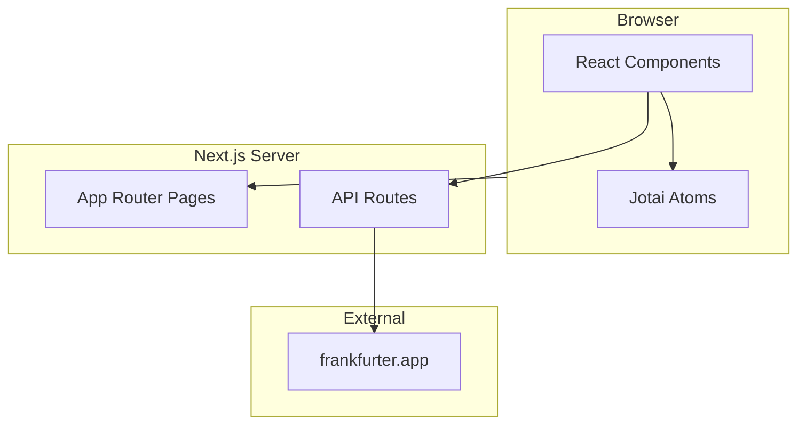

# 割り勘計算

旅行費用の割り勘を計算するWebアプリケーションです。

## 特徴

- **メンバー管理** - 旅行参加者を追加・削除
- **支出管理** - 誰が何にいくら払ったかを記録
- **自動精算** - 最小限の送金回数で精算方法を計算
- **複数通貨対応** - 海外旅行での異なる通貨に対応
- **リアルタイム為替** - 最新の為替レートを自動取得

## アーキテクチャ



## 技術スタック

| カテゴリ         | 技術                        |
| ---------------- | --------------------------- |
| フレームワーク   | Next.js 16.1.2 (App Router) |
| 言語             | TypeScript                  |
| スタイリング     | TailwindCSS + shadcn/ui     |
| 状態管理         | Jotai                       |
| バリデーション   | Zod                         |
| リンター         | ESLint v9 (flat config)     |
| フォーマッター   | Prettier                    |
| 未使用コード検出 | Knip                        |
| テスト           | Vitest                      |
| CI/CD            | GitHub Actions              |

## クイックスタート

```bash
# 依存関係のインストール
pnpm install

# 開発サーバー起動
pnpm dev

# http://localhost:3000 でアクセス
```

## 開発コマンド

| コマンド         | 説明                          |
| ---------------- | ----------------------------- |
| `pnpm dev`       | 開発サーバー起動（Turbopack） |
| `pnpm build`     | プロダクションビルド          |
| `pnpm test`      | テスト実行                    |
| `pnpm lint`      | ESLintでコードチェック        |
| `pnpm format`    | Prettierでフォーマット        |
| `pnpm knip`      | 未使用コード検出              |
| `pnpm typecheck` | TypeScript型チェック          |

## プロジェクト構造

```
src/
├── app/                    # Next.js App Router
│   ├── page.tsx            # ホームページ（グループ作成）
│   ├── group/              # グループダッシュボード
│   └── api/                # APIルート（為替レート）
├── components/             # Reactコンポーネント
│   ├── ui/                 # shadcn/ui
│   ├── group/              # グループ関連
│   ├── expense/            # 支出関連
│   ├── settlement/         # 精算関連
│   └── currency/           # 通貨設定
├── atoms/                  # Jotai atoms（状態管理）
├── lib/                    # ユーティリティ
└── types/                  # TypeScript型定義
```

## 精算アルゴリズム

貪欲法（Greedy Algorithm）を使用して、最小限の送金回数で精算を計算します。


詳細は [アルゴリズムドキュメント](docs/ALGORITHM.md) を参照。

## ドキュメント

| ドキュメント                                 | 説明                                       |
| -------------------------------------------- | ------------------------------------------ |
| [アーキテクチャ](docs/ARCHITECTURE.md)       | システム構成、状態管理、コンポーネント階層 |
| [セットアップ](docs/SETUP.md)                | 開発環境の構築方法                         |
| [API](docs/API.md)                           | REST API エンドポイントとデータ型          |
| [アルゴリズム](docs/ALGORITHM.md)            | 精算計算アルゴリズムの詳細                 |
| [コンポーネント](docs/COMPONENTS.md)         | Reactコンポーネントの仕様                  |
| [ユーザーフロー](docs/USER-FLOW.md)          | 画面遷移とユーザージャーニー               |
| [コントリビューション](docs/CONTRIBUTING.md) | 開発への参加方法                           |

## サポート通貨

| 通貨             | コード |
| ---------------- | ------ |
| 日本円           | JPY    |
| 米ドル           | USD    |
| ユーロ           | EUR    |
| 英ポンド         | GBP    |
| 韓国ウォン       | KRW    |
| 中国元           | CNY    |
| 台湾ドル         | TWD    |
| タイバーツ       | THB    |
| シンガポールドル | SGD    |
| 豪ドル           | AUD    |
| カナダドル       | CAD    |
| スイスフラン     | CHF    |
