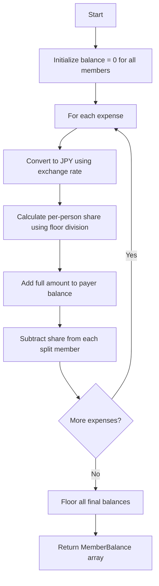
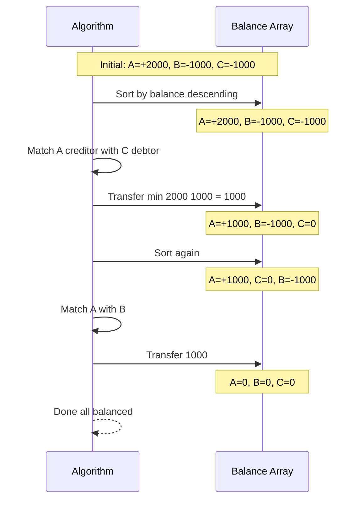
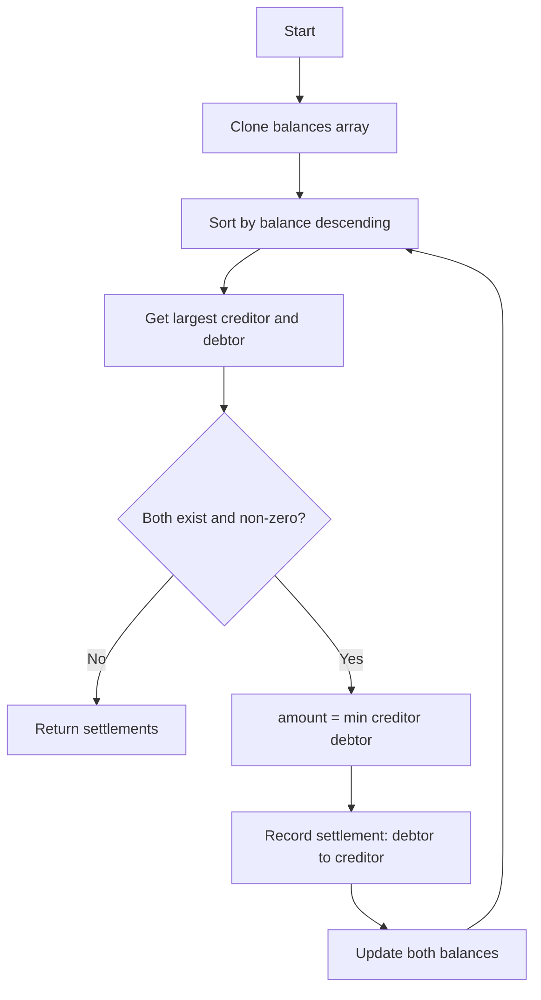

# 精算アルゴリズム

## 概要

このドキュメントでは、割り勘計算で使用される精算アルゴリズムについて詳しく説明します。

アルゴリズムは2つのフェーズで構成されています：

1. **収支計算（Balance Calculation）** - 各メンバーの収支を計算
2. **精算計算（Settlement Calculation）** - 最小限の送金回数で精算

## 収支計算

### フロー図



### アルゴリズム詳細

```typescript
function calculateBalances(members, expenses, currencies): MemberBalance[] {
  // 1. 全メンバーの残高を0で初期化
  const balanceMap = new Map<string, number>();
  members.forEach(member => balanceMap.set(member.id, 0));

  // 2. 各支出を処理
  expenses.forEach(expense => {
    // 2a. 通貨を円に変換
    const amountInJPY = expense.amount * currency.rateToJPY;

    // 2b. 1人あたりの負担額を計算（floor除算）
    const perPersonShare = Math.floor(amountInJPY / splitCount);

    // 2c. 支払者の残高に全額を加算
    balanceMap.set(payerId, balance + amountInJPY);

    // 2d. 各負担者の残高から負担額を減算
    splitAmong.forEach(memberId => {
      balanceMap.set(memberId, balance - perPersonShare);
    });
  });

  return balances;
}
```

### 収支の意味

| 収支 | 意味 | 例 |
|------|------|-----|
| プラス（+） | 立替分を受け取る側（債権者） | +2,000円 = 2,000円受け取る |
| マイナス（-） | 支払う側（債務者） | -1,000円 = 1,000円支払う |
| ゼロ（0） | 精算不要 | 支払額と負担額が一致 |

### Floor除算を使う理由

小数点以下の端数処理には `Math.floor()` を使用しています。

**例: 1,001円を2人で割り勘**

| 方法 | 計算結果 | 問題点 |
|------|----------|--------|
| 通常除算 | 500.5円 | 0.5円は送金不可 |
| 四捨五入 | 501円 × 2 = 1,002円 | 合計が元の金額を超える |
| **Floor除算** | 500円 × 2 = 1,000円 | 1円の差は支払者負担 |

Floor除算により、端数は常に支払者の負担となります。これは実際の割り勘でも自然な挙動です。

## 精算計算

### アルゴリズム可視化



### 貪欲法（Greedy Algorithm）



### アルゴリズム詳細

```typescript
function calculateSettlements(balances): Settlement[] {
  const settlements = [];
  const remaining = [...balances]; // Clone

  while (true) {
    // 1. 残高でソート（降順）
    remaining.sort((a, b) => b.balance - a.balance);

    const creditor = remaining[0];           // 最大の債権者
    const debtor = remaining[remaining.length - 1]; // 最大の債務者

    // 2. 終了条件チェック
    if (creditor.balance <= 0 || debtor.balance >= 0) break;

    // 3. 送金額を計算
    const amount = Math.min(creditor.balance, Math.abs(debtor.balance));

    // 4. 精算を記録
    settlements.push({ from: debtor, to: creditor, amount });

    // 5. 残高を更新
    creditor.balance -= amount;
    debtor.balance += amount;
  }

  return settlements;
}
```

### なぜ貪欲法が最適か

貪欲法は、各ステップで「最大の債権者」と「最大の債務者」をマッチングします。

**メリット:**
- 送金回数が最小化される
- 実装がシンプル
- 計算時間が短い

**証明（概略）:**
- 各送金で少なくとも1人の残高がゼロになる
- したがって、最大でも (n-1) 回の送金で全員の残高がゼロになる
- n = メンバー数

### 計算量

| 処理 | 時間計算量 |
|------|-----------|
| 収支計算 | O(E × M) |
| 精算計算 | O(M² log M) |

- E = 支出の数
- M = メンバーの数

実際のユースケース（数人〜数十人の旅行グループ）では、十分に高速です。

## 具体例

### 例1: 3人での単純な割り勘

**状況:**
- A, B, C の3人で旅行
- Aが3,000円の夕食代を支払い
- 3人で均等に割り勘

**収支計算:**

| メンバー | 支払額 | 負担額 | 収支 |
|---------|--------|--------|------|
| A | 3,000円 | 1,000円 | +2,000円 |
| B | 0円 | 1,000円 | -1,000円 |
| C | 0円 | 1,000円 | -1,000円 |

**精算結果:**
- B → A: 1,000円
- C → A: 1,000円

### 例2: 複数の支払者

**状況:**
- A, B, C の3人
- Aが2,100円の夕食代を支払い（3人で割り勘）
- Bが900円の飲み物代を支払い（3人で割り勘）

**収支計算:**

| メンバー | 夕食負担 | 飲み物負担 | 支払総額 | 負担総額 | 収支 |
|---------|---------|-----------|---------|---------|------|
| A | 700円 | 300円 | 2,100円 | 1,000円 | +1,100円 |
| B | 700円 | 300円 | 900円 | 1,000円 | -100円 |
| C | 700円 | 300円 | 0円 | 1,000円 | -1,000円 |

**精算結果:**
- C → A: 1,000円
- B → A: 100円

### 例3: 複数通貨（海外旅行）

**状況:**
- A, B の2人でハワイ旅行
- Aが$100の夕食代を支払い（レート: 1 USD = 150 JPY）
- 2人で割り勘

**収支計算:**

| 処理 | 計算 |
|------|------|
| 円換算 | $100 × 150 = 15,000円 |
| 1人あたり | 15,000 ÷ 2 = 7,500円 |
| Aの収支 | +15,000 - 7,500 = +7,500円 |
| Bの収支 | 0 - 7,500 = -7,500円 |

**精算結果:**
- B → A: 7,500円

## エッジケース

### 割り切れない金額

1,001円を3人で割り勘:
- 1人あたり: floor(1001 ÷ 3) = 333円
- 合計負担: 333 × 3 = 999円
- 差額2円は支払者負担

### 1人だけの負担

ホテル代をAが支払い、Aのみが負担（個室料金など）:
- 収支は相殺されてゼロ
- 精算は発生しない

### 0円の支出

金額が0円の場合、処理をスキップ（バリデーションで入力時に弾く）

## 参考文献

- [割り勘アプリの精算アルゴリズム - Qiita](https://qiita.com/MasashiHamaguchi/items/0348082984b8c94ca581)
- [Settling Debts Problem - Greedy Algorithm](https://en.wikipedia.org/wiki/Greedy_algorithm)
