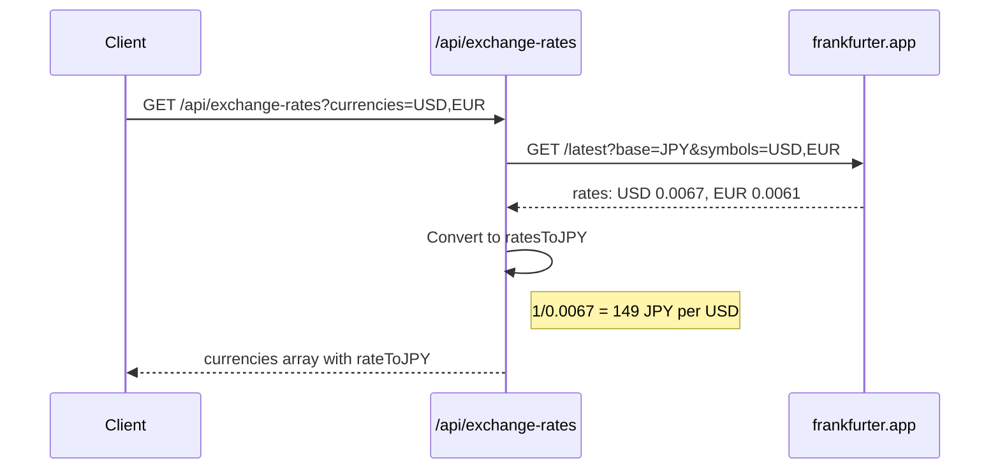
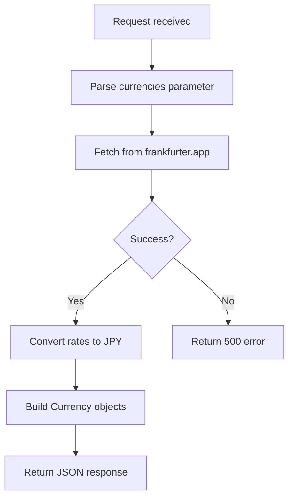

# API ドキュメント

## 概要

このアプリケーションはNext.js Route Handlersを使用したREST APIを提供します。

## アーキテクチャ

```mermaid
flowchart LR
    subgraph client [Client Browser]
        CurrencySelector[CurrencySelector Component]
    end

    subgraph nextjs [Next.js Server]
        RouteHandler[/api/exchange-rates]
    end

    subgraph external [External API]
        Frankfurter[frankfurter.app]
    end

    CurrencySelector -->|GET request| RouteHandler
    RouteHandler -->|Fetch rates| Frankfurter
    Frankfurter -->|JSON response| RouteHandler
    RouteHandler -->|Converted rates| CurrencySelector
```

## エンドポイント

### GET /api/exchange-rates

為替レートを取得します。

#### シーケンス図



#### リクエスト

```
GET /api/exchange-rates
GET /api/exchange-rates?currencies=USD,EUR,KRW
```

#### パラメータ

| パラメータ | 型 | 必須 | 説明 |
|-----------|-----|------|------|
| currencies | string | No | カンマ区切りの通貨コード（例: `USD,EUR,KRW`） |

#### レスポンス

成功時（200 OK）:

```json
{
  "base": "JPY",
  "date": "2024-01-16",
  "currencies": [
    {
      "code": "JPY",
      "symbol": "¥",
      "name": "日本円",
      "rateToJPY": 1
    },
    {
      "code": "USD",
      "symbol": "$",
      "name": "米ドル",
      "rateToJPY": 149.25
    },
    {
      "code": "EUR",
      "symbol": "€",
      "name": "ユーロ",
      "rateToJPY": 163.93
    }
  ]
}
```

#### エラーレスポンス

失敗時（500 Internal Server Error）:

```json
{
  "error": "Failed to fetch exchange rates"
}
```

#### 処理フロー



## 外部API

### frankfurter.app

為替レートの取得に使用。ECB（欧州中央銀行）のデータを基にしています。

**特徴:**
- APIキー不要
- 無料で使用可能
- 毎日更新

#### エンドポイント

```
GET https://api.frankfurter.app/latest?base=JPY
GET https://api.frankfurter.app/latest?base=JPY&symbols=USD,EUR
```

#### レスポンス例

```json
{
  "amount": 1,
  "base": "JPY",
  "date": "2024-01-16",
  "rates": {
    "USD": 0.0067,
    "EUR": 0.0061
  }
}
```

#### レート変換

frankfurter.appは「1 JPY = X USD」形式でレートを返します。
アプリでは「1 USD = X JPY」形式が必要なため、逆数を計算します。

```typescript
// frankfurter.appからのレート: 1 JPY = 0.0067 USD
const rateFromJPY = 0.0067;

// アプリで使用するレート: 1 USD = ? JPY
const rateToJPY = 1 / rateFromJPY; // = 149.25
```

ドキュメント: https://www.frankfurter.app/docs/

## データ型

### Group

```typescript
interface Group {
  id: string;
  name: string;
  createdAt: Date;
}
```

### Member

```typescript
interface Member {
  id: string;
  name: string;
}
```

### Expense

```typescript
interface Expense {
  id: string;
  /** 支払者のメンバーID */
  payerId: string;
  /** 金額（指定通貨単位） */
  amount: number;
  /** 通貨コード（JPY, USD, EUR等） */
  currency: string;
  /** 支出の説明 */
  description: string;
  /** 割り勘対象のメンバーID配列 */
  splitAmong: string[];
  createdAt: Date;
}
```

### Settlement

```typescript
interface Settlement {
  /** 支払う側のメンバーID（債務者） */
  from: string;
  /** 受け取る側のメンバーID（債権者） */
  to: string;
  /** 金額（円） */
  amount: number;
}
```

### Currency

```typescript
interface Currency {
  /** 通貨コード（ISO 4217） */
  code: string;
  /** 通貨記号 */
  symbol: string;
  /** 通貨名（日本語） */
  name: string;
  /** 1単位あたりの円換算レート */
  rateToJPY: number;
}
```

### MemberBalance

```typescript
interface MemberBalance {
  memberId: string;
  memberName: string;
  /** プラス: 受け取る / マイナス: 支払う */
  balance: number;
}
```

## サポートされている通貨

| コード | 記号 | 名称 |
|--------|------|------|
| JPY | ¥ | 日本円 |
| USD | $ | 米ドル |
| EUR | € | ユーロ |
| GBP | £ | 英ポンド |
| KRW | ₩ | 韓国ウォン |
| CNY | ¥ | 中国元 |
| TWD | NT$ | 台湾ドル |
| THB | ฿ | タイバーツ |
| SGD | S$ | シンガポールドル |
| AUD | A$ | 豪ドル |
| CAD | C$ | カナダドル |
| CHF | Fr | スイスフラン |
