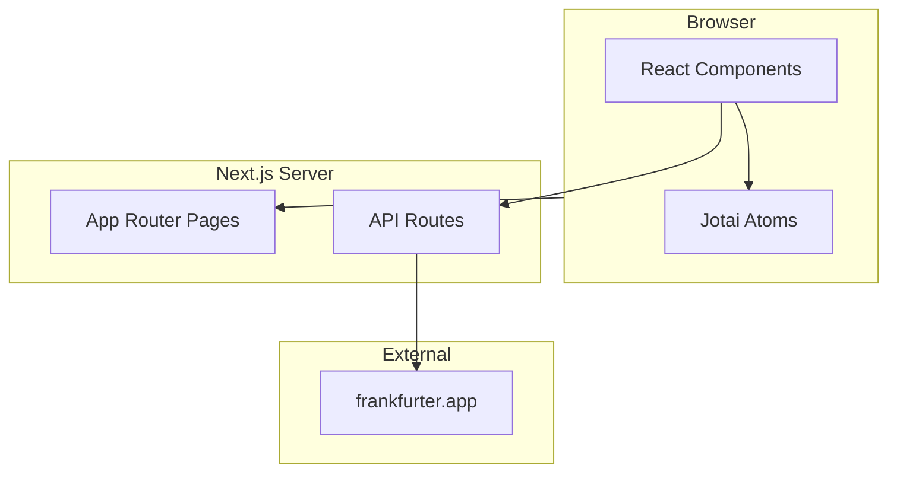
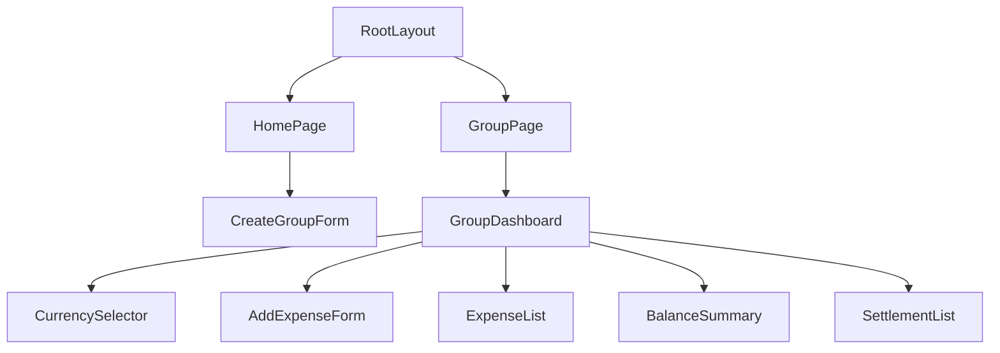
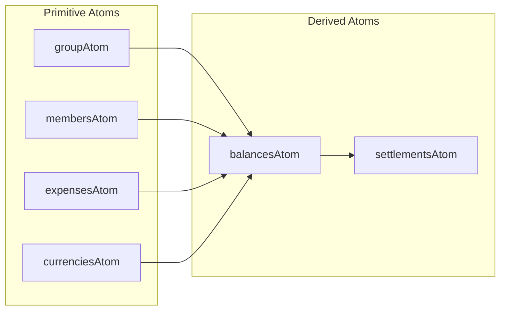

# アーキテクチャ

## 概要

旅行の割り勘計算を行うサンプルWebアプリケーションです。
Next.js App Routerで構築しています。

## システム構成図



## 技術スタック

| カテゴリ               | 技術                        |
| ---------------------- | --------------------------- |
| フレームワーク         | Next.js 16.1.2 (App Router) |
| 言語                   | TypeScript                  |
| スタイリング           | TailwindCSS + shadcn/ui     |
| 状態管理               | Jotai                       |
| バリデーション         | Zod                         |
| リンター               | ESLint v9 (flat config)     |
| フォーマッター         | Prettier                    |
| 未使用コード検出       | Knip                        |
| パッケージマネージャー | pnpm                        |
| テスト                 | Vitest                      |
| CI/CD                  | GitHub Actions              |

## ディレクトリ構造

```
src/
├── app/                    # Next.js App Router
│   ├── layout.tsx          # ルートレイアウト
│   ├── page.tsx            # ホームページ（グループ作成）
│   ├── group/              # グループダッシュボード
│   └── api/                # APIルート（為替レート）
├── components/
│   ├── providers/          # Jotai Provider
│   ├── ui/                 # shadcn/ui コンポーネント
│   ├── group/              # グループ関連コンポーネント
│   ├── expense/            # 支出関連コンポーネント
│   ├── settlement/         # 精算関連コンポーネント
│   └── currency/           # 通貨設定コンポーネント
├── atoms/                  # Jotai atoms
├── lib/                    # ユーティリティ
└── types/                  # TypeScript型定義
```

## コンポーネント階層



## Server Components vs Client Components

### Server Components（デフォルト）

- `app/layout.tsx` - ルートレイアウト
- `app/page.tsx` - ホームページ
- `app/group/page.tsx` - グループページ

### Client Components（`'use client'`）

- `components/providers/jotai-provider.tsx` - Jotai Provider
- `components/group/*` - フォーム、ダッシュボード
- `components/expense/*` - 支出管理
- `components/settlement/*` - 精算表示
- `components/currency/*` - 通貨設定

## 状態管理（Jotai）

Jotaiのatomsを使用して状態を管理します。

### 状態フロー図



### Primitive Atoms

| Atom                     | 型              | 説明                   |
| ------------------------ | --------------- | ---------------------- |
| `groupAtom`              | `Group \| null` | グループ情報           |
| `membersAtom`            | `Member[]`      | メンバー一覧           |
| `expensesAtom`           | `Expense[]`     | 支出一覧               |
| `currenciesAtom`         | `Currency[]`    | 為替レート付き通貨一覧 |
| `selectedCurrenciesAtom` | `string[]`      | 選択された通貨コード   |

### Derived Atoms（計算値）

| Atom              | 依存                          | 説明             |
| ----------------- | ----------------------------- | ---------------- |
| `balancesAtom`    | members, expenses, currencies | 各メンバーの収支 |
| `settlementsAtom` | balances                      | 精算リスト       |

Derived Atomsは依存するatomが変更されると自動的に再計算されます。

## 精算アルゴリズム

詳細は [ALGORITHM.md](./ALGORITHM.md) を参照してください。

1. 各メンバーの収支を計算（支払額 - 負担額）
2. 収支でソート（最大債権者を先頭に）
3. 最大債権者と最大債務者をマッチング
4. 送金額 = min(債権者の収支, |債務者の収支|)
5. 残高が0になるまで繰り返す

参考: https://qiita.com/MasashiHamaguchi/items/0348082984b8c94ca581

## 為替API

frankfurter.app（https://www.frankfurter.app/）を使用。
APIキー不要、無料で使用可能。

```
GET https://api.frankfurter.app/latest?base=JPY
```

詳細は [API.md](./API.md) を参照してください。
