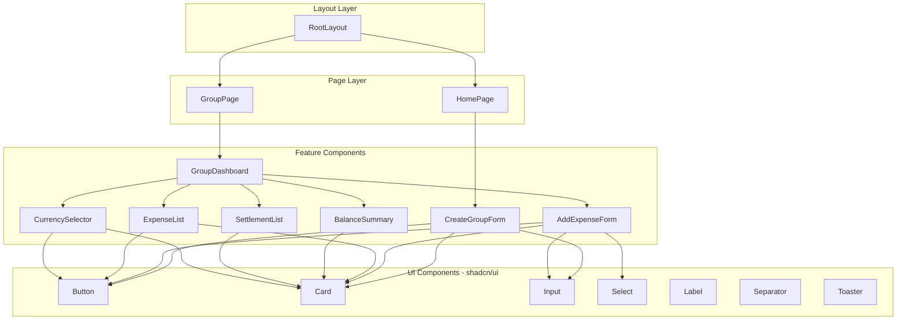
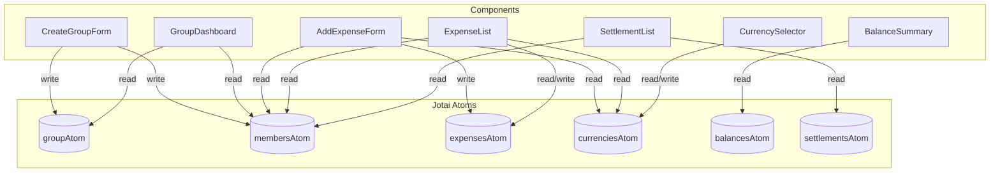

# コンポーネント

## 概要

このドキュメントでは、アプリケーションで使用されるReactコンポーネントについて説明します。

## コンポーネント階層



## データフロー



---

## ページコンポーネント

### RootLayout

ルートレイアウト。全ページ共通のプロバイダーとスタイルを設定。

**ファイル:** `src/app/layout.tsx`

**タイプ:** Server Component

**責務:**
- Jotai Provider のラップ
- Toaster コンポーネントの配置
- フォント設定（Geist Sans/Mono）
- メタデータ設定

### HomePage

ホームページ。グループ作成フォームを表示。

**ファイル:** `src/app/page.tsx`

**タイプ:** Server Component

**責務:**
- ヘッダー表示
- CreateGroupForm の配置

### GroupPage

グループダッシュボードページ。

**ファイル:** `src/app/group/page.tsx`

**タイプ:** Server Component

**責務:**
- ヘッダー表示（ホームへのリンク付き）
- GroupDashboard の配置

---

## フィーチャーコンポーネント

### CreateGroupForm

グループとメンバーを作成するフォーム。

**ファイル:** `src/components/group/create-group-form.tsx`

**タイプ:** Client Component

**使用するAtoms:**
| Atom | 操作 |
|------|------|
| `groupAtom` | write |
| `membersAtom` | read/write |
| `expensesAtom` | write（リセット） |
| `selectedCurrenciesAtom` | write（リセット） |

**ローカルState:**
| State | 型 | 説明 |
|-------|-----|------|
| `groupName` | string | グループ名入力値 |
| `memberName` | string | メンバー名入力値 |
| `groupNameError` | string | グループ名バリデーションエラー |
| `memberNameError` | string | メンバー名バリデーションエラー |

**機能:**
- グループ名の入力とバリデーション
- メンバーの追加・削除
- グループ作成とページ遷移
- 前回のグループデータのリセット

**バリデーション:**
- グループ名: 1〜50文字
- メンバー名: 1〜20文字、重複不可
- 最低2人のメンバーが必要

---

### GroupDashboard

グループのメインダッシュボード。

**ファイル:** `src/components/group/group-dashboard.tsx`

**タイプ:** Client Component

**使用するAtoms:**
| Atom | 操作 |
|------|------|
| `groupAtom` | read |
| `membersAtom` | read |

**責務:**
- グループ情報の表示
- 子コンポーネントのレイアウト配置
- グループが存在しない場合のリダイレクト

**子コンポーネント:**
- CurrencySelector
- AddExpenseForm
- ExpenseList
- BalanceSummary
- SettlementList

---

### AddExpenseForm

支出を追加するフォーム。

**ファイル:** `src/components/expense/add-expense-form.tsx`

**タイプ:** Client Component

**使用するAtoms:**
| Atom | 操作 |
|------|------|
| `membersAtom` | read |
| `currenciesAtom` | read |
| `expensesAtom` | read/write |

**ローカルState:**
| State | 型 | 説明 |
|-------|-----|------|
| `payerId` | string | 支払者ID |
| `amount` | string | 金額（文字列として管理） |
| `currency` | string | 通貨コード |
| `description` | string | 説明 |
| `splitAmong` | string[] | 割り勘対象メンバーID |

**機能:**
- 支払者の選択
- 金額と通貨の入力
- 説明の入力
- 割り勘対象の選択（個別/全員）
- バリデーションとエラー表示

**バリデーション:**
- 支払者: 必須
- 金額: 0より大きい
- 説明: 1〜100文字
- 割り勘対象: 1人以上

---

### ExpenseList

支出一覧を表示・管理。

**ファイル:** `src/components/expense/expense-list.tsx`

**タイプ:** Client Component

**使用するAtoms:**
| Atom | 操作 |
|------|------|
| `expensesAtom` | read/write |
| `membersAtom` | read |
| `currenciesAtom` | read |

**機能:**
- 支出一覧の表示
- 各支出の詳細表示（金額、支払者、割り勘対象）
- 支出の削除
- 空状態の表示

---

### BalanceSummary

各メンバーの収支バランスを表示。

**ファイル:** `src/components/settlement/balance-summary.tsx`

**タイプ:** Client Component

**使用するAtoms:**
| Atom | 操作 |
|------|------|
| `balancesAtom` | read |

**機能:**
- 各メンバーの収支を表示
- プラス（受け取る）は緑色
- マイナス（支払う）は赤色
- ゼロは灰色

---

### SettlementList

精算方法（誰が誰にいくら払うか）を表示。

**ファイル:** `src/components/settlement/settlement-list.tsx`

**タイプ:** Client Component

**使用するAtoms:**
| Atom | 操作 |
|------|------|
| `settlementsAtom` | read |
| `membersAtom` | read |

**機能:**
- 最適化された精算リストの表示
- 「誰 → 誰: 金額」形式で表示
- 精算不要の場合のメッセージ表示

---

### CurrencySelector

通貨選択と為替レート取得。

**ファイル:** `src/components/currency/currency-selector.tsx`

**タイプ:** Client Component

**使用するAtoms:**
| Atom | 操作 |
|------|------|
| `currenciesAtom` | read/write |
| `selectedCurrenciesAtom` | read/write |

**ローカルState:**
| State | 型 | 説明 |
|-------|-----|------|
| `isLoading` | boolean | API呼び出し中フラグ |

**機能:**
- 利用可能な通貨の選択/解除
- JPYは常に選択済み（解除不可）
- 為替レートの取得（API呼び出し）
- 現在のレート表示
- ローディング状態の表示

---

## UIコンポーネント

shadcn/ui を使用した再利用可能なコンポーネント群。

**ファイル:** `src/components/ui/`

### Button

```typescript
interface ButtonProps {
  variant?: 'default' | 'destructive' | 'outline' | 'secondary' | 'ghost' | 'link';
  size?: 'default' | 'sm' | 'lg' | 'icon' | 'icon-sm' | 'icon-lg';
  asChild?: boolean;
}
```

### Card

```typescript
// Card, CardHeader, CardTitle, CardDescription, CardContent, CardFooter
// 各コンポーネントは className で拡張可能
```

### Input

```typescript
interface InputProps extends React.InputHTMLAttributes<HTMLInputElement> {
  // 標準のHTMLInput属性を継承
}
```

### Select

```typescript
// Select, SelectTrigger, SelectValue, SelectContent, SelectItem
// Radix UI の Select をラップ
```

### Label

```typescript
interface LabelProps extends React.LabelHTMLAttributes<HTMLLabelElement> {
  // 標準のHTMLLabel属性を継承
}
```

### Separator

水平または垂直の区切り線。

### Toaster

トースト通知の表示。Sonner ライブラリを使用。

---

## プロバイダー

### JotaiProvider

Jotai の Provider コンポーネントをラップ。

**ファイル:** `src/components/providers/jotai-provider.tsx`

**責務:**
- Jotai のグローバルストアを提供
- 子コンポーネントでの atom 使用を有効化
