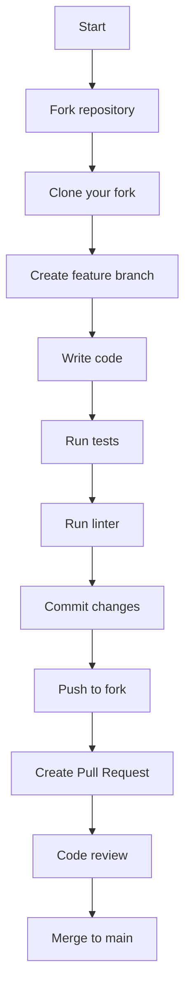
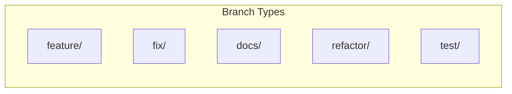
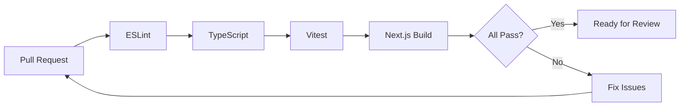
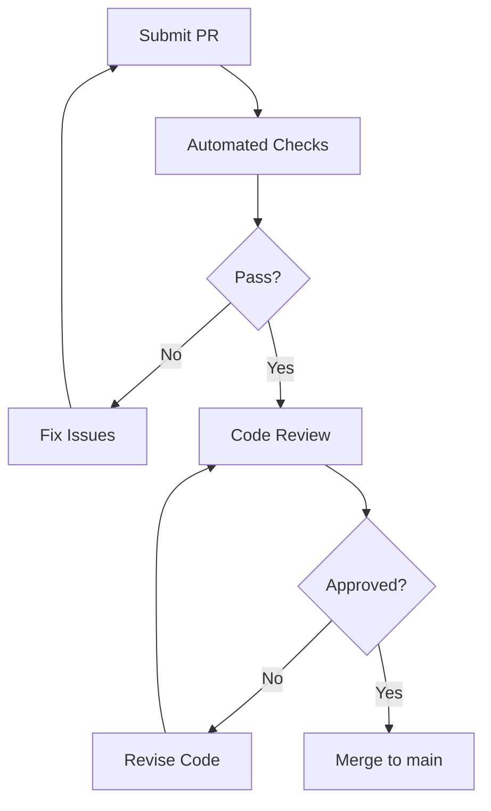

# コントリビューションガイド

## 概要

このドキュメントでは、プロジェクトへの貢献方法について説明します。

## 開発環境のセットアップ

詳細は [SETUP.md](./SETUP.md) を参照してください。

```bash
# リポジトリをクローン
git clone <repository-url>
cd warikan

# 依存関係をインストール
pnpm install

# 開発サーバーを起動
pnpm dev
```

## 開発ワークフロー



## ブランチ命名規則



| プレフィックス | 用途 | 例 |
|---------------|------|-----|
| `feature/` | 新機能 | `feature/add-export-csv` |
| `fix/` | バグ修正 | `fix/settlement-rounding` |
| `docs/` | ドキュメント | `docs/update-readme` |
| `refactor/` | リファクタリング | `refactor/expense-form` |
| `test/` | テスト追加 | `test/settlement-edge-cases` |

## コミットメッセージ

[Conventional Commits](https://www.conventionalcommits.org/) に従います。

### フォーマット

```
<type>(<scope>): <description>

[optional body]

[optional footer]
```

### タイプ

| タイプ | 説明 |
|--------|------|
| `feat` | 新機能 |
| `fix` | バグ修正 |
| `docs` | ドキュメントのみの変更 |
| `style` | コードの意味に影響しない変更（空白、フォーマット等） |
| `refactor` | バグ修正でも新機能でもないコード変更 |
| `test` | テストの追加・修正 |
| `chore` | ビルドプロセスやツールの変更 |

### 例

```bash
# 新機能
feat(expense): add CSV export functionality

# バグ修正
fix(settlement): handle edge case when amount is odd

# ドキュメント
docs(readme): update installation instructions

# リファクタリング
refactor(atoms): simplify derived atom logic
```

## コードスタイル

### TypeScript

- `strict` モードを使用
- `any` の使用を避ける
- 明示的な型定義を推奨

```typescript
// Good
function calculateTotal(expenses: Expense[]): number {
  return expenses.reduce((sum, e) => sum + e.amount, 0);
}

// Bad
function calculateTotal(expenses: any): any {
  return expenses.reduce((sum: any, e: any) => sum + e.amount, 0);
}
```

### React

- 関数コンポーネントを使用
- 適切なフックの使用（`useState`, `useEffect`, `useMemo` など）
- Jotai の `useAtom`, `useAtomValue`, `useSetAtom` を適切に使い分ける

```typescript
// 読み取りのみ
const members = useAtomValue(membersAtom);

// 書き込みのみ
const setMembers = useSetAtom(membersAtom);

// 読み書き両方
const [members, setMembers] = useAtom(membersAtom);
```

### ファイル構成

```
src/
├── app/           # ページとAPIルート
├── components/    # Reactコンポーネント
│   ├── ui/        # 再利用可能なUIコンポーネント
│   └── [feature]/ # 機能別コンポーネント
├── atoms/         # Jotai atoms
├── lib/           # ユーティリティ関数
└── types/         # TypeScript型定義
```

## テスト

### テストの実行

```bash
# 全テスト実行
pnpm test

# ウォッチモード
pnpm test:watch

# カバレッジ
pnpm test:coverage
```

### テストの書き方

```typescript
import { describe, it, expect } from 'vitest';
import { calculateBalances } from '@/lib/settlement';

describe('calculateBalances', () => {
  it('should return zero balances when no expenses', () => {
    const members = [{ id: '1', name: 'A' }];
    const result = calculateBalances(members, [], [JPY]);
    expect(result[0]?.balance).toBe(0);
  });
});
```

### テストファイルの配置

```
__tests__/
├── setup.ts                    # テストセットアップ
├── settlement.test.ts          # ユニットテスト
└── create-group-form.test.tsx  # コンポーネントテスト
```

## リンティングとフォーマット

### コマンド

```bash
# ESLint
pnpm lint          # チェック
pnpm lint:fix      # 自動修正

# Prettier
pnpm format        # フォーマット
pnpm format:check  # チェック

# TypeScript
pnpm typecheck     # 型チェック

# Knip
pnpm knip          # 未使用コード検出
```

### CI での検証

プルリクエストでは以下が自動実行されます：



## プルリクエスト

### PRを作成する前に

1. 最新の `main` ブランチをマージ/リベース
2. 全テストがパス
3. リンターエラーがない
4. 型エラーがない

### PRテンプレート

```markdown
## 概要
<!-- 変更内容の簡潔な説明 -->

## 変更種別
- [ ] 新機能
- [ ] バグ修正
- [ ] リファクタリング
- [ ] ドキュメント
- [ ] その他

## 変更内容
<!-- 詳細な変更内容 -->

## テスト
<!-- 追加したテストや手動テストの内容 -->

## スクリーンショット
<!-- UI変更がある場合 -->

## チェックリスト
- [ ] テストを追加/更新した
- [ ] ドキュメントを更新した
- [ ] ESLint/Prettierでチェック済み
- [ ] TypeScriptの型エラーがない
```

### レビュープロセス



## イシュー

### バグ報告

```markdown
## 概要
<!-- バグの簡潔な説明 -->

## 再現手順
1. ...
2. ...
3. ...

## 期待される動作
<!-- どうなるべきか -->

## 実際の動作
<!-- 何が起きたか -->

## 環境
- ブラウザ: 
- OS: 
```

### 機能リクエスト

```markdown
## 概要
<!-- 機能の簡潔な説明 -->

## 動機
<!-- なぜこの機能が必要か -->

## 提案する解決策
<!-- どのように実装するか -->

## 代替案
<!-- 他の方法があれば -->
```

## 質問

質問がある場合は、Issueを作成するか、既存のドキュメントを参照してください。

- [アーキテクチャ](./ARCHITECTURE.md)
- [API](./API.md)
- [コンポーネント](./COMPONENTS.md)
- [アルゴリズム](./ALGORITHM.md)
