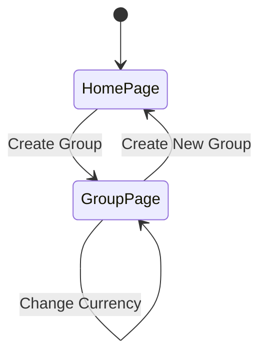
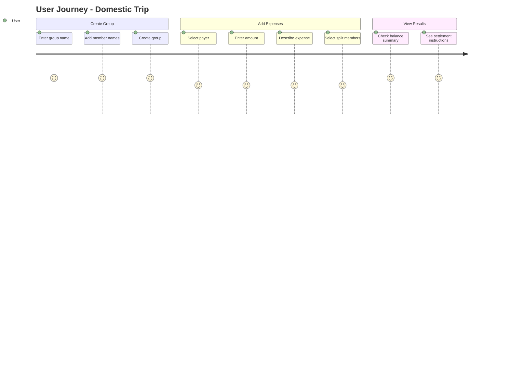
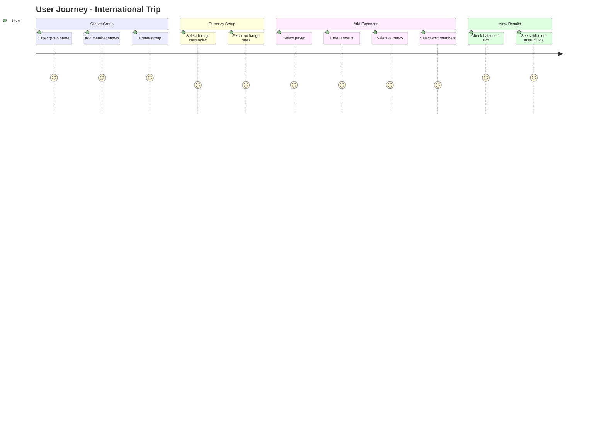
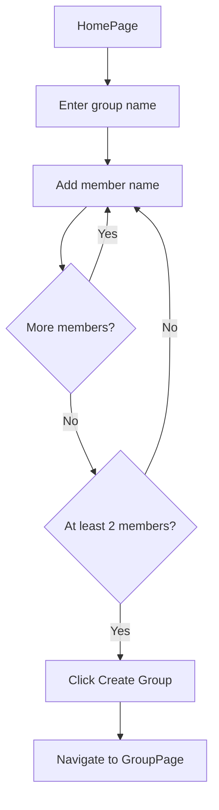
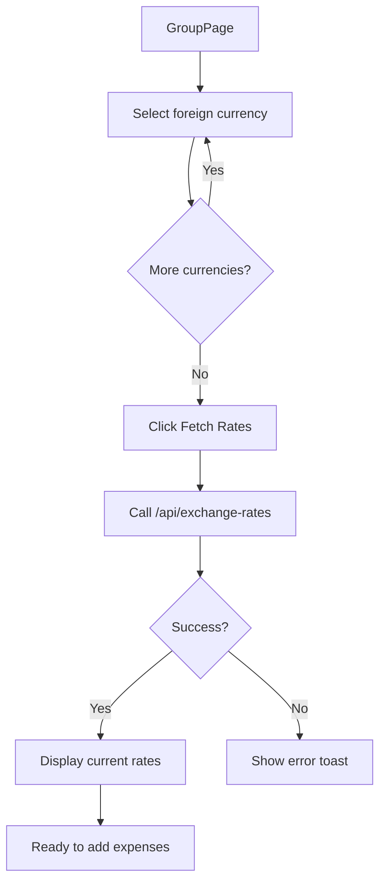
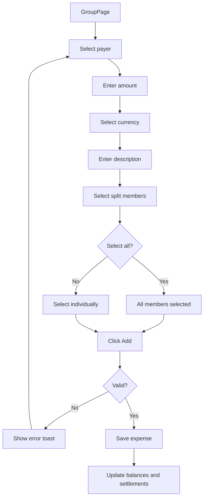
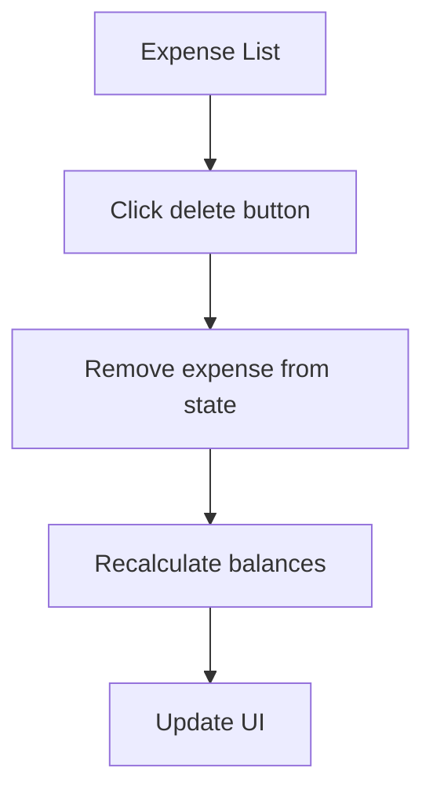
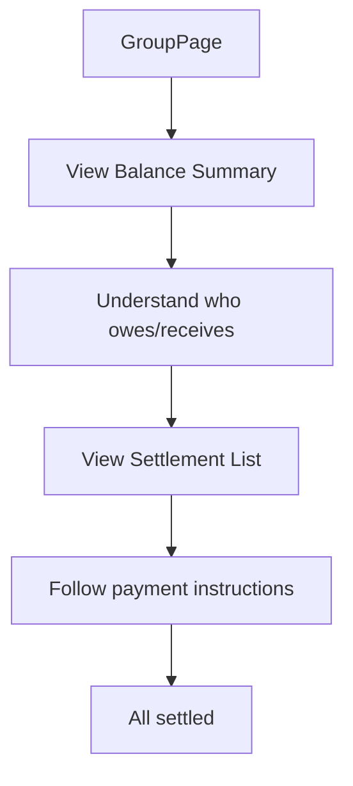
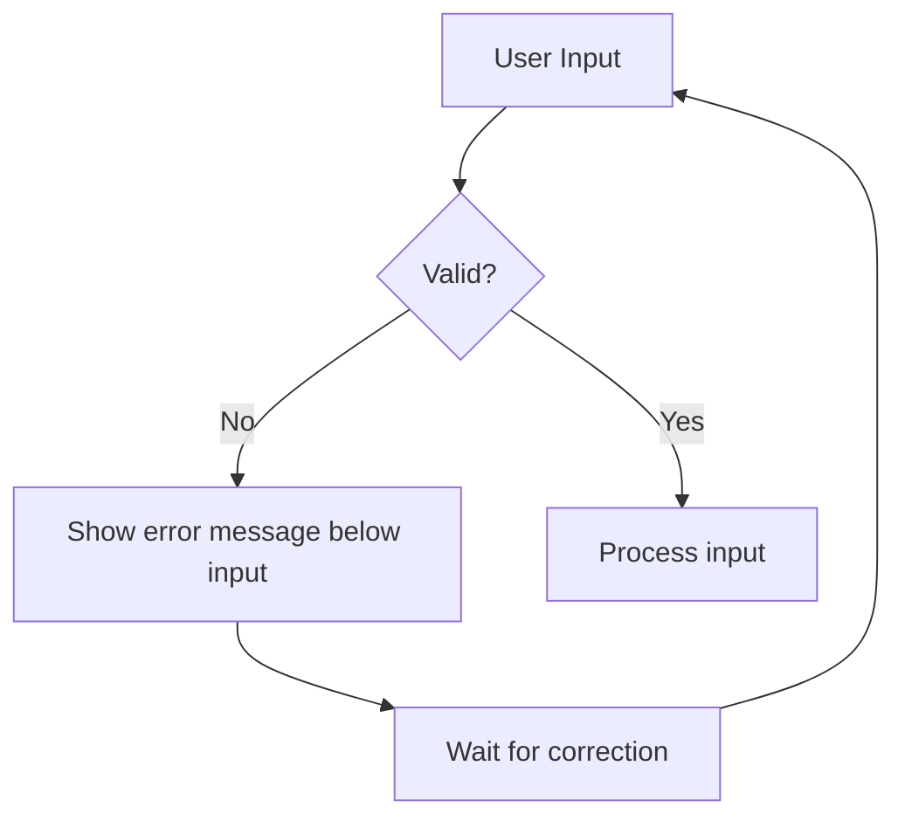
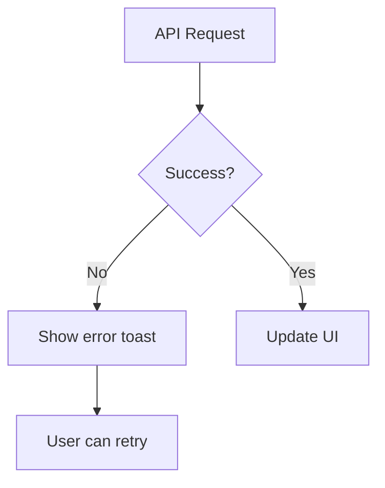

# ユーザーフロー

## 概要

このドキュメントでは、アプリケーションのユーザーフローと画面遷移について説明します。

## 画面遷移図



## ユーザージャーニー（国内旅行）



## ユーザージャーニー（海外旅行）



## 詳細フロー

### 1. グループ作成フロー



**バリデーション:**
- グループ名: 1〜50文字
- メンバー名: 1〜20文字
- 最低メンバー数: 2人
- 重複した名前は不可

### 2. 通貨設定フロー（海外旅行用）



**サポート通貨:**
- JPY（日本円）- 常に選択済み
- USD, EUR, GBP, KRW, CNY, TWD, THB, SGD, AUD, CAD, CHF

### 3. 支出追加フロー



**バリデーション:**
- 支払者: 必須
- 金額: 0より大きい数値
- 説明: 1〜100文字
- 割り勘対象: 最低1人

### 4. 支出削除フロー



### 5. 精算確認フロー



## 画面構成

### ホームページ（/）

```
┌─────────────────────────────┐
│         割り勘計算           │  ← Header
├─────────────────────────────┤
│  ┌───────────────────────┐  │
│  │     グループ名         │  │  ← Card: Group Name
│  │  ┌─────────────────┐  │  │
│  │  │ 北海道旅行        │  │  │  ← Input
│  │  └─────────────────┘  │  │
│  └───────────────────────┘  │
│                             │
│  ┌───────────────────────┐  │
│  │     メンバー名         │  │  ← Card: Members
│  │  ┌──────────┐ [追加]  │  │
│  │  │          │         │  │  ← Input + Button
│  │  └──────────┘         │  │
│  │  ┌─────────────────┐  │  │
│  │  │ 田中    [×]      │  │  │  ← Member List
│  │  │ 鈴木    [×]      │  │  │
│  │  └─────────────────┘  │  │
│  └───────────────────────┘  │
│                             │
│  ┌───────────────────────┐  │
│  │   グループを作成        │  │  ← Create Button
│  └───────────────────────┘  │
└─────────────────────────────┘
```

### グループページ（/group）

```
┌─────────────────────────────┐
│         割り勘計算           │  ← Header (link to home)
├─────────────────────────────┤
│  ┌───────────────────────┐  │
│  │      北海道旅行        │  │  ← Group Info Card
│  │   3人: 田中、鈴木、佐藤 │  │
│  └───────────────────────┘  │
│                             │
│  ┌───────────────────────┐  │
│  │ 🌐 通貨設定            │  │  ← Currency Selector
│  │ [JPY] [USD] [EUR] ... │  │
│  │ [為替レートを取得]     │  │
│  └───────────────────────┘  │
│                             │
│  ┌───────────────────────┐  │
│  │ ➕ 支出を追加          │  │  ← Add Expense Form
│  │ 支払者: [選択]        │  │
│  │ 金額: [    ] [JPY▼]   │  │
│  │ 何に: [            ]  │  │
│  │ 割り勘: [全員選択]    │  │
│  │ [田中] [鈴木] [佐藤]  │  │
│  │      [追加する]       │  │
│  └───────────────────────┘  │
│  ─────────────────────────  │
│  ┌───────────────────────┐  │
│  │ 🧾 支出一覧 (2件)      │  │  ← Expense List
│  │ ┌───────────────────┐ │  │
│  │ │レンタカー ¥30,000 │ │  │
│  │ │田中が支払い→全員  │ │  │
│  │ └───────────────────┘ │  │
│  └───────────────────────┘  │
│  ─────────────────────────  │
│  ┌───────────────────────┐  │
│  │ 💰 収支バランス        │  │  ← Balance Summary
│  │ 田中: +¥20,000 (緑)   │  │
│  │ 鈴木: -¥10,000 (赤)   │  │
│  │ 佐藤: -¥10,000 (赤)   │  │
│  └───────────────────────┘  │
│  ─────────────────────────  │
│  ┌───────────────────────┐  │
│  │ ✅ 精算方法            │  │  ← Settlement List
│  │ ┌───────────────────┐ │  │
│  │ │鈴木 → 田中 ¥10,000│ │  │
│  │ │佐藤 → 田中 ¥10,000│ │  │
│  │ └───────────────────┘ │  │
│  └───────────────────────┘  │
└─────────────────────────────┘
```

## インタラクション

### トースト通知

| アクション | メッセージ | タイプ |
|-----------|-----------|--------|
| グループ作成 | 「グループを作成しました」 | Success |
| 支出追加 | 「支出を追加しました」 | Success |
| 為替レート取得 | 「為替レートを取得しました」 | Success |
| バリデーションエラー | 各種エラーメッセージ | Error |
| API エラー | 「為替レートの取得に失敗しました」 | Error |

### キーボード操作

| 画面 | キー | アクション |
|------|------|-----------|
| メンバー入力 | Enter | メンバーを追加 |
| 全般 | Tab | 次の入力フィールドへ移動 |

## エラーハンドリング

### バリデーションエラー



### API エラー


